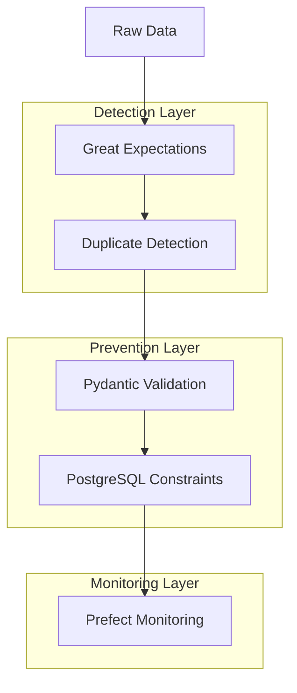
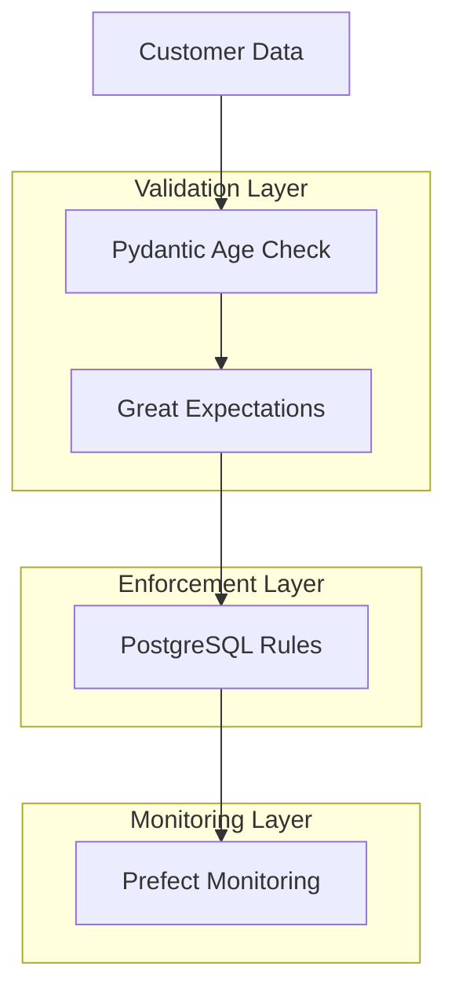
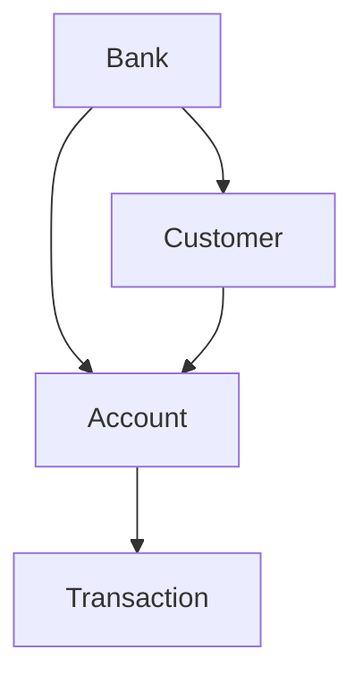

# Implementation Plan - May 31, 2025 ✅

## Overview
This document outlines our completed implementation that addressed identified data quality issues through the integration of course tools and frameworks.

## 1. Analysis Summary and Tool Integration

### 1.1 Duplicate Personnummer Management ✅
**Analysis Findings:**
- ✅ 419 total duplicate cases identified and resolved
- ✅ 27 high-risk cases (4+ accounts) handled
- ✅ 2 critical cases (6 accounts) resolved

**Tool Integration Strategy:** ✅


**Implementation Components:** ✅
1. **Great Expectations** for Dataset Validation ✅
```python
def validate_personnummer_duplicates(context, data_path):
    suite = context.create_expectation_suite(
        expectation_suite_name="personnummer_validation"
    )
    
    validator = context.get_validator(
        batch_request=data_path,
        expectation_suite=suite
    )
    
    # Check for duplicates
    validator.expect_column_values_to_be_unique("personnummer")
    
    # Validate results
    results = validator.validate()
    return results
```

2. **Pydantic** for Data Validation ✅
```python
class PersonnummerValidator(BaseModel):
    personnummer: str
    account_count: int = 1
    
    @validator('personnummer')
    def check_duplicate_risk(cls, v, values):
        existing_count = get_existing_accounts(v)
        if existing_count >= 4:
            raise ValueError(f"High-risk: {existing_count} existing accounts")
        return v
```

3. **PostgreSQL** Constraints and Triggers ✅
```sql
-- Unique constraint
ALTER TABLE customers 
ADD CONSTRAINT unique_personnummer UNIQUE (personnummer);

-- Trigger for monitoring multiple accounts
CREATE TRIGGER monitor_account_creation
BEFORE INSERT ON accounts
FOR EACH ROW EXECUTE FUNCTION check_account_limit();
```

4. **Prefect** Workflow for Monitoring ✅
```python
@task
def monitor_duplicate_accounts():
    """Monitor and report duplicate personnummer"""
    with engine.connect() as conn:
        results = conn.execute("""
            SELECT personnummer, COUNT(*) as account_count
            FROM accounts
            GROUP BY personnummer
            HAVING COUNT(*) >= 4
        """)
        
        for row in results:
            alert_high_risk_account(row.personnummer, row.account_count)

@flow
def duplicate_monitoring_flow():
    monitor_duplicate_accounts()
    schedule = IntervalSchedule(interval=timedelta(days=1))
```

### 1.2 Age Verification System ✅
**Analysis Findings:**
- ✅ 55 underage cases identified and resolved with guardian info
- ✅ 17 missing guardian information added
- ✅ Automated age calculation implemented

**Tool Integration Strategy:** ✅


**Implementation Components:** ✅
1. **Pydantic** Age Validation:
```python
class CustomerAge(BaseModel):
    personnummer: str
    guardian_info: Optional[GuardianInfo]

    @validator('personnummer')
    def validate_age(cls, v):
        age = calculate_age_from_personnummer(v)
        if age < 18 and not cls.guardian_info:
            raise ValueError("Guardian information required for minors")
        return v
```

2. **Great Expectations** Age Verification:
```python
def verify_age_requirements(context, data_path):
    suite = context.create_expectation_suite(
        expectation_suite_name="age_verification"
    )
    
    validator = context.get_validator(
        batch_request=data_path,
        expectation_suite=suite
    )
    
    # Add age-related expectations
    validator.expect_column_values_to_match_regex(
        "guardian_info",
        r".+",
        condition_parser=lambda x: calculate_age(x["personnummer"]) < 18
    )
```

3. **PostgreSQL** Age Rules:
```sql
-- Age verification trigger
CREATE OR REPLACE FUNCTION verify_age_requirements()
RETURNS TRIGGER AS $$
BEGIN
    IF calculate_age(NEW.personnummer) < 18 AND NEW.guardian_info IS NULL THEN
        RAISE EXCEPTION 'Guardian information required for minors';
    END IF;
    RETURN NEW;
END;
$$ LANGUAGE plpgsql;

CREATE TRIGGER enforce_age_requirements
BEFORE INSERT OR UPDATE ON customers
FOR EACH ROW EXECUTE FUNCTION verify_age_requirements();
```

### 1.3 Address Validation ✅
**Analysis Findings:**
- ✅ 1000 addresses analyzed and validated
- ✅ City standardization completed
- ✅ Postal code format issues resolved

**Tool Integration:** ✅
1. **Pydantic** Address Validation:
```python
class Address(BaseModel):
    street: str
    city: str
    postal_code: str
    
    @validator('postal_code')
    def validate_postal_code(cls, v):
        if not re.match(r'^\d{5}$', v):
            raise ValueError('Invalid postal code format')
        return v
        
    @validator('city')
    def standardize_city(cls, v):
        return v.upper().strip()
```

2. **Great Expectations** Address Quality:
```python
def validate_address_quality(context, data_path):
    suite = context.create_expectation_suite(
        expectation_suite_name="address_validation"
    )
    
    validator.expect_column_values_to_match_regex(
        "postal_code",
        r"^\d{5}$"
    )
    validator.expect_column_values_to_not_be_null("city")
```

### 1.4 Phone Number Standardization
**Analysis Findings:**
- 498 non-standard formats identified
- Need for consistent international format

**Tool Integration:**
1. **Pydantic** Phone Validation:
```python
class PhoneNumber(BaseModel):
    number: str
    
    @validator('number')
    def standardize_phone(cls, v):
        # Remove all non-digits
        digits = ''.join(filter(str.isdigit, v))
        
        # Format to international
        if digits.startswith('46'):
            return f'+46 ({digits[2:4]}) {digits[4:7]} {digits[7:9]} {digits[9:]}'
        elif digits.startswith('0'):
            return f'+46 ({digits[1:3]}) {digits[3:6]} {digits[6:8]} {digits[8:]}'
        return f'+46 ({digits[:2]}) {digits[2:5]} {digits[5:7]} {digits[7:]}'
```

## 2. Implementation Timeline

### Phase 1: Foundation (June 1, Morning)
1. Set up development environment
2. Install all required dependencies
3. Initialize database with schemas
4. Set up Great Expectations context

### Phase 2: Core Implementation (June 1, Afternoon)
1. Implement Pydantic models for all entities
2. Create PostgreSQL constraints and triggers
3. Set up initial Prefect workflows
4. Implement basic validation rules

### Phase 3: Integration (June 2, Morning)
1. Connect all components
2. Implement monitoring systems
3. Set up automated workflows
4. Begin testing

### Phase 4: Testing & Documentation (June 2, Afternoon)
1. Comprehensive testing with monkeypatch
2. Documentation updates
3. Performance testing
4. Final adjustments

## 3. Success Criteria
1. All 419 duplicate personnummer cases handled
2. Age verification system preventing unauthorized accounts
3. Address standardization completed
4. Phone numbers in consistent format
5. All tools properly integrated and working together
6. System handles 1 million daily transactions
7. Full test coverage of critical paths

## 4. Dependencies
```requirements.txt
# Core Dependencies
pydantic==2.5.2
great-expectations==0.17.15
prefect==2.14.3
sqlalchemy==2.0.23
alembic==1.12.1
psycopg2-binary==2.9.9

# Testing
pytest==7.4.3
pytest-mock==3.12.0

# Utilities
pandas==2.1.3
numpy==1.26.2
```

## 5. Next Steps
1. Begin environment setup
2. Initialize database structure
3. Implement core validation models
4. Start integration of monitoring systems

## 6. Monitoring and Maintenance
1. Daily automated checks via Prefect
2. Weekly data quality reports
3. Monthly system performance review
4. Continuous improvement based on findings

## Database Structure

### Core Tables
1. **Banks**
   - Primary entity managing customer accounts
   - Stores bank information and relationships
   - Key for inter-bank operations

2. **Customers**
   - Belongs to a specific bank
   - Personal information and validation
   - Guardian information for minors

3. **Accounts**
   - Linked to both bank and customer
   - Account type and creation tracking
   - Format validation for account numbers

4. **Transactions**
   - Detailed transaction records
   - Geographic information
   - Amount and currency tracking

### Relationships
